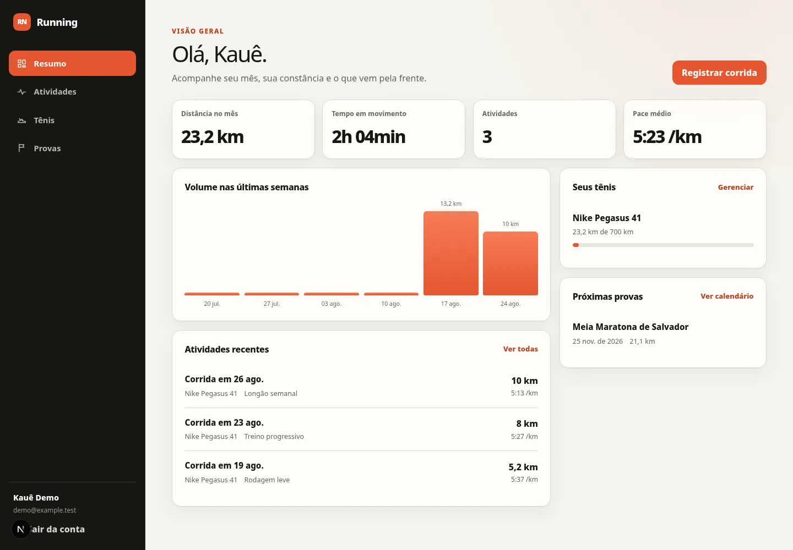
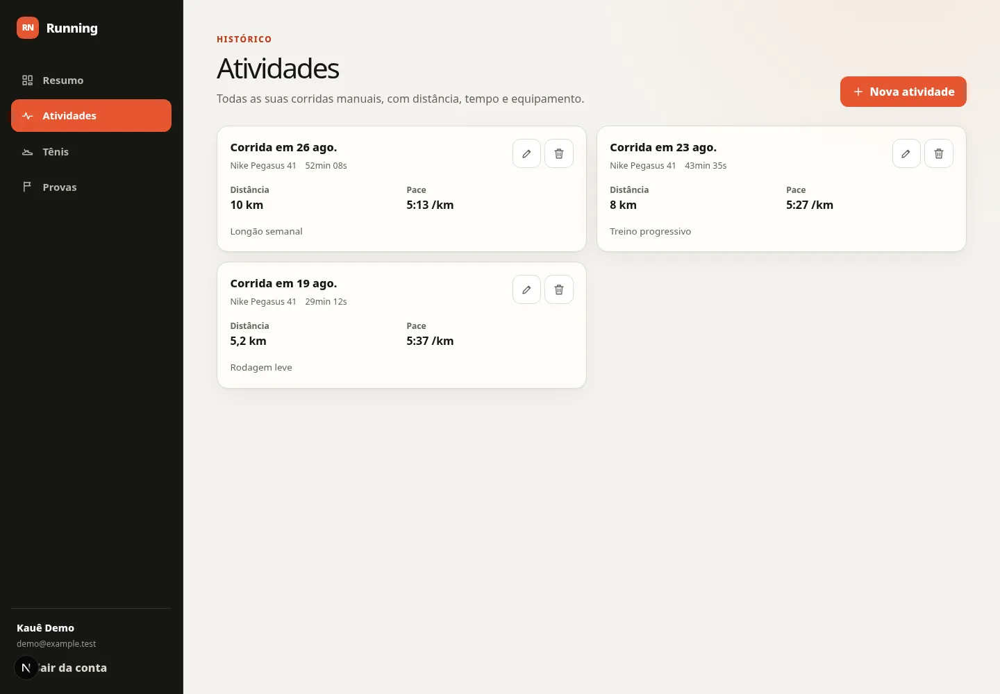
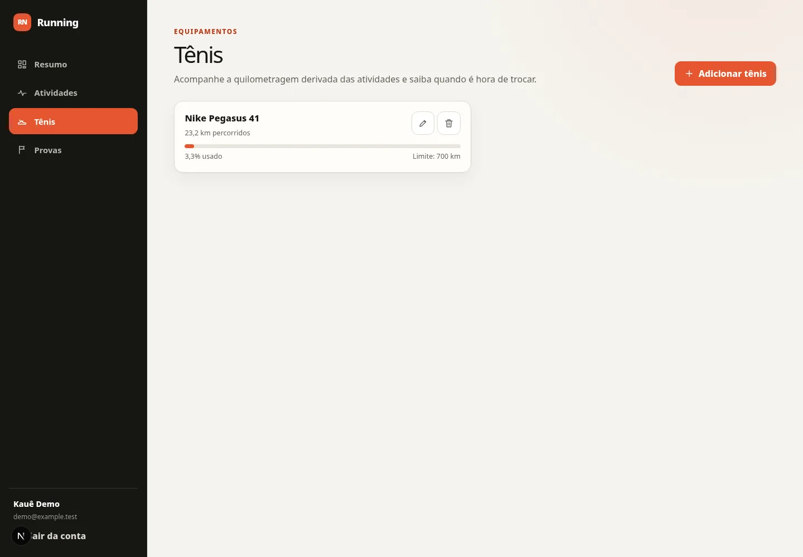
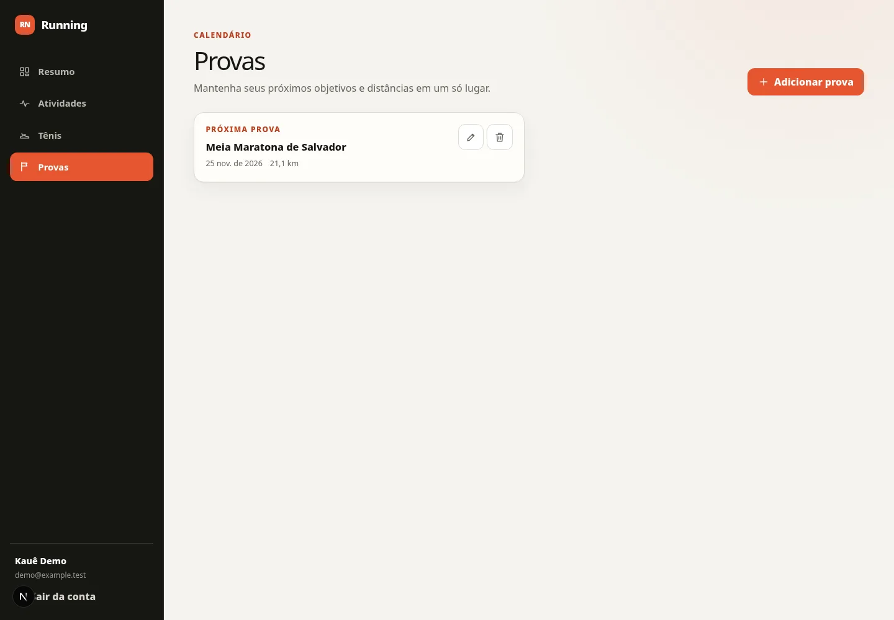
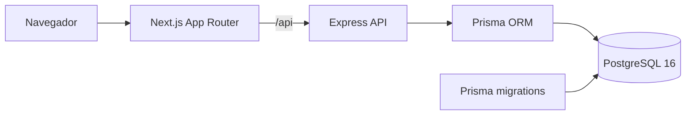
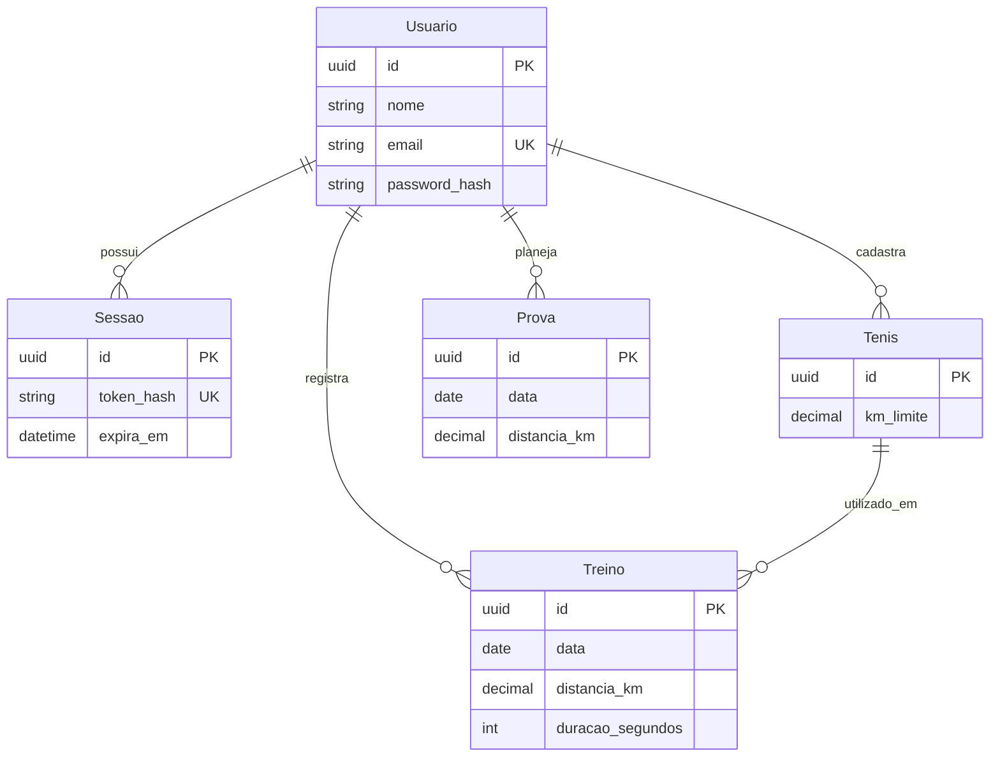

# Running Analytics — public showcase

Este repositório contém uma versão pública sanitizada do Running Analytics. O repositório de produção, credenciais, dados e arquivos operacionais de infraestrutura permanecem privados.

O Running Analytics é uma aplicação full stack multiusuário para registrar corridas, acompanhar a vida útil dos tênis, planejar provas e visualizar indicadores semanais. A aplicação está disponível em [running.kaue.space](https://running.kaue.space/).

## Produto

As imagens abaixo foram geradas em ambiente local com dados fictícios.



| Atividades | Tênis | Provas |
| --- | --- | --- |
|  |  |  |

## Funcionalidades

- cadastro, login e logout com sessões persistidas no PostgreSQL;
- dashboard com volume semanal, ritmo médio, atividades recentes, tênis e próximas provas;
- CRUD de atividades com distância, duração, data, observações e tênis utilizado;
- acompanhamento da quilometragem e da vida útil estimada dos tênis;
- planejamento de provas futuras;
- paginação por cursor, validação de entrada e tratamento consistente de erros;
- interface responsiva para desktop e dispositivos móveis.

## Arquitetura



- **Frontend:** Next.js App Router e React, com renderização no servidor nas rotas protegidas.
- **API:** Express 5, Zod, Helmet e limites de requisição.
- **Persistência:** PostgreSQL 16 e Prisma com migrations versionadas.
- **Ambiente local:** Dockerfiles e Compose sanitizado, sem conexão com a infraestrutura real.

## Autenticação e autorização

- senhas protegidas com Argon2id;
- tokens de sessão opacos gerados com 256 bits de entropia;
- somente o hash SHA-256 do token é persistido;
- cookies `HttpOnly`, `Secure` e `SameSite=Lax` no ambiente apropriado;
- limitação de tentativas por IP e identidade nos endpoints de autenticação;
- consultas de atividades, tênis e provas limitadas ao usuário autenticado;
- restrições relacionais que impedem associações entre contas diferentes.

## Modelo de dados



O esquema completo está em [`prisma/schema.prisma`](prisma/schema.prisma).

## Tecnologias

- TypeScript, Node.js e Express;
- Next.js e React;
- PostgreSQL e Prisma;
- Zod, Argon2id, Helmet e rate limiting;
- Docker e Docker Compose;
- Node Test Runner, Supertest, Vitest, Testing Library e Playwright.

## Execução local

Requisitos: Docker e Docker Compose.

```bash
docker compose -f compose.example.yaml up --build --wait
```

A interface fica disponível em `http://localhost:3000` e a API em `http://localhost:3333`. O Compose utiliza somente valores fictícios e um volume local próprio.

Para desenvolvimento direto com Node.js 24, use [`.env.example`](.env.example) como referência, instale as dependências com `npm ci` em cada pacote e execute backend e frontend separadamente.

## Testes

O gate completo usa apenas um PostgreSQL descartável local:

```bash
npm run test:all
```

Ele executa:

- testes unitários do backend;
- testes de integração HTTP e isolamento entre contas;
- migrations em banco novo e cenário legado;
- lint, TypeScript, testes de componentes e build do frontend.

Os testes E2E esperam a aplicação local integrada:

```bash
cd frontend-corrida
PLAYWRIGHT_BASE_URL=http://localhost:3000 npm run test:e2e
```

## Decisões de segurança

- nenhum dado de domínio é persistido em `localStorage`;
- senhas e tokens de sessão nunca são retornados pela API;
- mutações exigem origem permitida e conteúdo JSON;
- identificadores de outra conta resultam em recurso não encontrado;
- o banco do exemplo local não é exposto além de `localhost`;
- os containers da aplicação usam usuário sem privilégios, filesystem somente leitura e capacidades removidas.

## Limitações do showcase

- não contém histórico Git do produto privado;
- não contém credenciais, dados de usuários, dumps, backups ou arquivos `.env` reais;
- não contém configuração operacional, rotinas de backup ou procedimentos de acesso a servidores;
- não contém workflows de deploy nem integração com provedores de nuvem;
- não é a fonte de deploy de [running.kaue.space](https://running.kaue.space/);
- o código público pode divergir da implementação privada usada em produção.

## Autoria

Projeto de [Kauê Fernandes](https://github.com/fernandes-kaue), da modelagem e API à interface, testes e empacotamento local.
